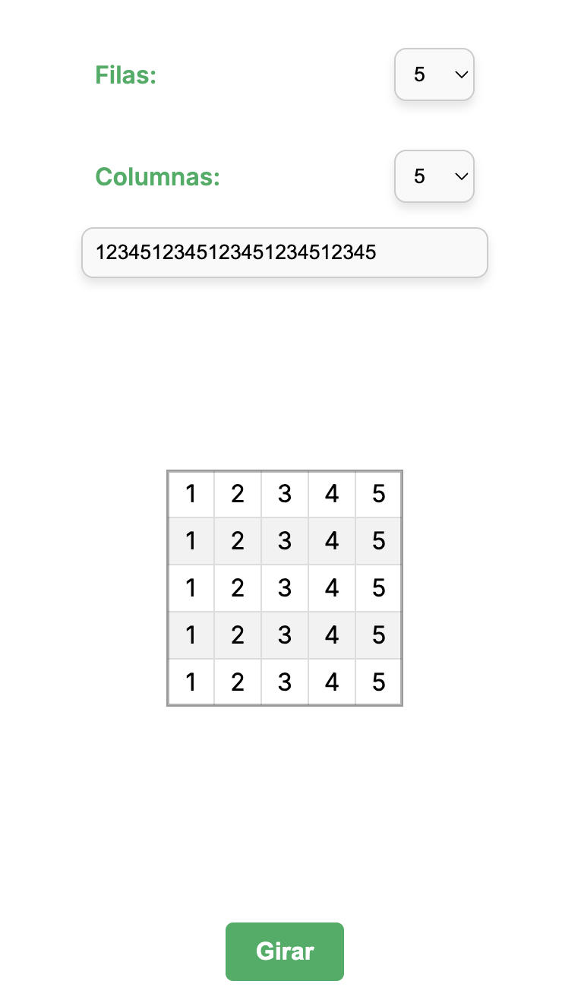

# matrix-app

## Project Description

Application that dynamically creates a matrix, which can be configured to have up to a maximum of 10 rows and 10 columns and can also be rectangular. It offers the functionality to rotate the matrix 90 degrees and reset it as many times as desired. If you reload the browser, you won't lose the data, as the application includes data persistence.



## Used Tools

-  <span>React</span>

-  <span>Next</span>

## Another used packages

- Jest

- React testing library

## How to use it

1. Clone the repository

```
git clone https://github.com/sazukeR/matrix-app.git
```

2. Move to project folder

```
cd matrix-app
```

3. Install project dependencies

```
npm install
```

4. Run the project

```
npm run dev
```
